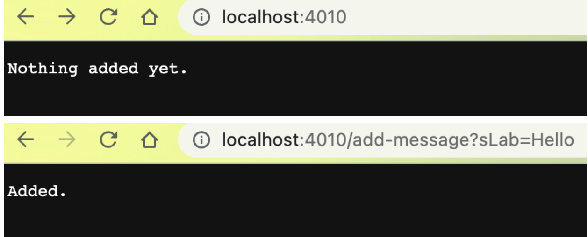
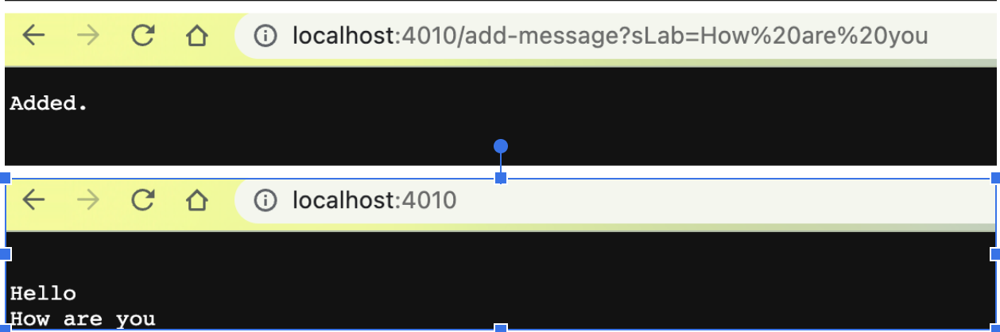
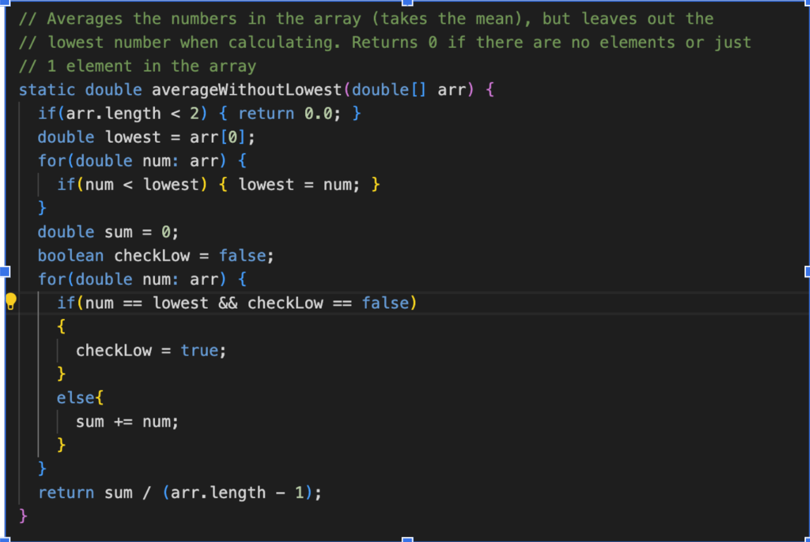

# **Lab Two**

## Part One
  
  
1. I called the handleRequest method
2. The relevent arguments to those method are check form the URI and calling the method form taking the string form the uri. Then take the value that I needed to add in a arrayList for main page parint out.
3. When we our uri changing over time, the specific thing had change is the path and query
  
1. Later two String were added in to the arraylist and It will update the main page
2. I had use the printout method for the Strings that I had added by changing a part of uri.
3. In main page there are no change had made in the code.
  

## Part two
In week 3 lab, we have been woking on fixing bugs and learning how to use eclipse. 

One of the bug that we have to fix is below..  
  
Reading the implementation, I notice that this code will not add all numbers thats equals to the lowest number which is buggy. Later I added a checker to clear the bug.

## Part Three
I have learn using assertEquals in cse 12 but I have learn many new stuff!!  
One importent thing I think it is extramly important is the use of Git hub.  
Another stuff that I think is also important is the skills of making webs.
